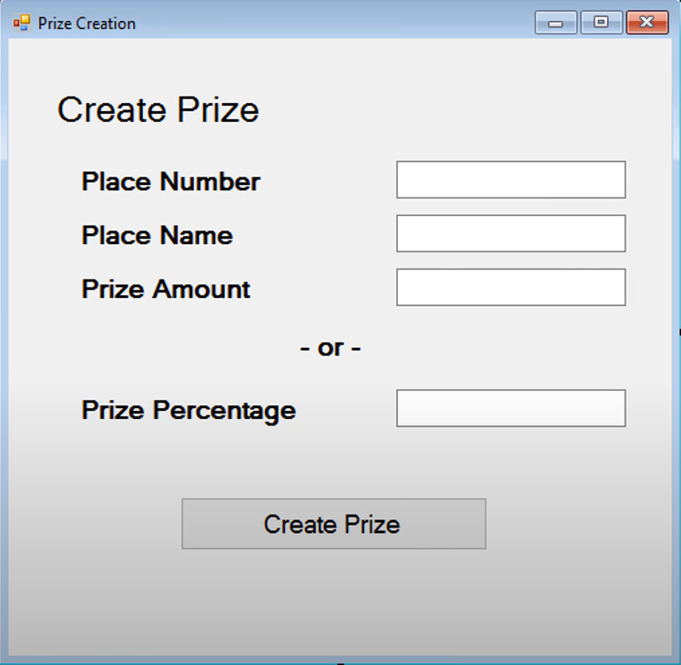

# TournamentTracker ([Tim Corey Full C# Course - App Start to Finish][1])

In this course, we will Develop na App to manage a tournament.

It's important to note that this course was made using .NET Framework and Visual Studio 2017, while I'm following using .NET 6 and Visual Studio 2022. That means I might need to change some aspects during the development process.

The same goes for SQL Server. While the course uses SQL Server 2017 Developer Edition, I'm using SQL Server 2019 Developer Edition.

## 1. Planning Step 1 - Initial Planning

**MISTAKE #1**: Start coding before understanding deeper

### Requirements

At first, we get the requirements from the customer/friend/our initial thoughts, which is not as complete as we expect. But it represents the base for the full requirements.

> No matter if it's a personal project, a project for a friend or a project at work.
> There will always be more requirements!

For the current project, the requirements are:

1. Tracks games played and their outcomes (who won)
2. Multiple competitors play in the tournament
3. Creates a tournament plan (who plays in what order)
4. Schedules games
5. A single loss eliminates a player
6. The last player standing is the winner

From the base requirements, we usually have some questions that may expand the requirements. For the current project, the questions below may serve as an example:

1. How many players will the tournament handle? Is it variable?
2. If a tournament has less than the full complement of players, how do we handle it?
3. Should the order of who plays each other be random or be ordered by input order?
4. Should we schedule the game or are they just played whenever?
5. If the games are scheduled, how does the system know when to schedule games for?
6. If the games are played whenever, can a game from the second round be played before the first round is complete?
7. Does the system need to store a score of some kind or just who won?
8. What type of front-end should this system have (form, webpage, app, etc.)?
**MISTAKE #2**: Assumptions
9. Where will the data be stored?
10. Will this system handle some kind of fees, prizes or other payouts?
11. What type of reporting is needed?
12. Who can fill in the results of a game?
13. Are there varying levels of access?
14. Should this system contact users about upcoming games?
15. Is each players on their own or can teams use this tournament tracker?

## 2. Planning Step 2 - Overview Planning

After having a conversation with the stakeholder(s), and asking those questions, we came out with some answers, as follows.

### Reviewing answers to our questions

1. How many players will the tournament handle? Is it variable?
   ***The application should be able to handle a variable number of players in a tournament.***
2. If a tournament has less than the full complement of players, how do we handle it?
   ***A tournament with less than the perfect number (a multiple of 2, so 4, 8, 16, 32, etc.) should add in "byes". Basically. certain people selected at random get to skip the first round and act as if they won.***
3. Should the order of who plays each other be random or be ordered by input order?
   ***The ordering of the tournament should be random.***
4. Should we schedule the game or are they just played whenever?
   ***The games should be played in whenever order and whenever the players want to play them.***
5. If the games are scheduled, how does the system know when to schedule games for?
   ***They are not scheduled, so we do not care.***
6. If the games are played whenever, can a game from the second round be played before the first round is complete?
   ***No. Each round should be fully completed before next round is displayed.***
7. Does the system need to store a score of some kind or just who won?
   ***Storing a simple score would be nice. Just a number for each player. that way, the tracker can be flexible enough to handle a checkers tournament (the winner would have a 1 and the loser a 0) or a basketball tournament.***
8. What type of front-end should this system have (form, webpage, app, etc.)?
   ***The systems should be a desktop system for now, but down the road we might want to turn it into an app or a website.***
9. Where will the data be stored?
   ***Ideally***, the data should be stores in a Microsoft SQL database but please put an option to store to a text file instead.
10. Will this system handle some kind of fees, prizes or other payouts?
    ***Yes. The tournament should have the option of charging an entry fee. Prizes should also be an option, where the tournament administrator chooses how much money to award a variable number of places. the total cash amount should not exceed the income from the tournament. A percentage-based system would also be nice to specify.***
11. What type of reporting is needed?
    ***A simple report specifying the outcome of the games per round as well as a report that specifies who won and how much they won. these can be just displayed on a form or they can be emailed to tournament competitors and the administrator.***
12. Who can fill in the results of a game?
    ***Anyone using the application should be able to fill in the game scores.***
13. Are there varying levels of access?
    ***No. The only method of varied access is if the competitors are not allowed into application and instead, they everything via email.***
14. Should this system contact users about upcoming games?
    ***Yes, the system should email users that they are due to play in a round as well as who scheduled to play.***
15. Is each players on their own or can teams use this tournament tracker?
    ***The tournament tracker should be able to handle the addition of other members. All members should be treated as equals in that they all get tournament emails. Teams should be also be able to name their team.***

> Learn to ask better questions!

### Big Picture Design

* **Structure**: Windows Forms application and Class Library
* **Data**: SQL and/or Text File
  *What that data looks like or how it is designed, or if we are going to use 1 text file or many, all those questions will be don later.*
* **Users**: One at a time on one application

* **Key concepts**
  * Email
  * SQL
  * Custom Events
  * Erro Handling
  * Interfaces
  * Random Ordering
  * Texting/SMS (Bonus/Extra)

## 3. Planning Step 3 - Data Design

### Mapping the Data (ESIN)

Do it on paper first!

**Team**

* TeamMembers (List<Person>)
* TeamName (string)

**Person**

* FirstName (string)
* LastName (string)
* EmailAddress (string)
* CellphoneNumber (string)

**Tournament**

* TournamentName (string)
* EntryFee (decimal) -> decimal is more precise. That is why we usually only use it for money.
* EnteredTeams (List<Team>)
* Prizes (List<Prize>)
* Rounds (List<List<Matchup>>)

**Prize**

* PlaceNumber (int)
* PlaceName (string)
* PrizeAmount (decimal)
* PrizePercentage (double)

**Matchup**

* Entries (List<MatchupEntry>)
* Winner (Team)
* MatchupRound (int)

**MatchupEntry**

* TeamCompeting (Team)
* Score (double)
* ParentMatchup (Matchup)

## 4. Planning Step 4 - User Interface Design

Do it on paper first!

> Don't start the design in Visual Studio!

### Tournament Viewer Form

### Tournament Creator Form

### Team Creator Form

### Prize Creator Form

### Tournament Dashboard Form

## 5. Planning Step 5 - Logic Planning

In this step we go through the Windows Forms and plan what each action should do and start thinking of how we should do it.

| We realized that the Create Team window is missing a Delete button to delete a member.

## 6. Programming Step 1 - Class Library Creation

In this step we created the class library according to our design from "Planning Step 3 - Data Design".

## 7. Programming Step 2 - Form Building

In this step we actually build the forms designed before.

## 8. Programming Step 3 - SQL Database Design

In this step we create all the tables and some stored procedures for later use.

## 9. Programming Step 4 - Prize Form Wire Up

In this step we create all the logic related to the Prize form.

## 10. Programming Step 5 - SQL Connection

Here we add all the needed libraries and configurations for the database connection. We also added a new stored procedure to insert data in the Prizes table.

## 11. Programming Step 6 - Text Connection

Here we add the ability to read and save to a text file.

## 12. Programming Step 7 - Create Team Form Part 1 (Create Person)

In this step, we added the logic to create new person in both a database and text file, as we've done before for the prize.

[1]: https://www.youtube.com/watch?v=YF-3SpIGkYM&list=PLLWMQd6PeGY3t63w-8MMIjIyYS7MsFcCi
